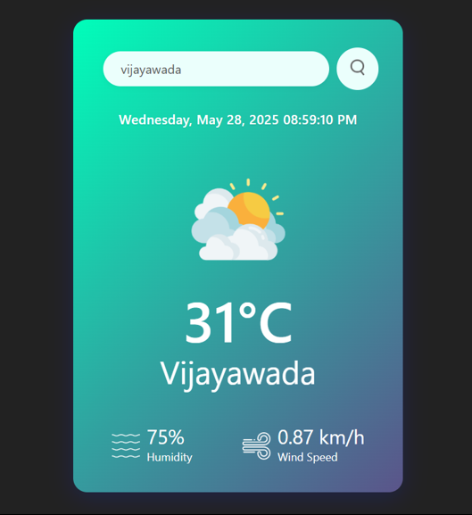

# Weather App  

A simple weather application that displays current weather conditions for any city worldwide, along with live date and time.  

---

## Live Demo  
🔹 **Check out the live demo of the Weather App below:**

 

---  

## Features  
- Real-time weather data (temperature, humidity, wind speed, conditions)  
- Live updating date and time  
- Responsive design (mobile & desktop friendly)  
- Error handling for invalid city names  
- Weather icons matching current conditions  

## Technologies Used  
- **HTML5, CSS3, JavaScript (ES6)**  
- **OpenWeatherMap API** (for weather data)  

---  

## API Key Setup & Security  

### How to Get an API Key  
1. Go to OpenWeatherMap webiste.
2. Sign up for a **free account**  
3. Navigate to the **API Keys** section in your dashboard  
4. Generate a new key (it may take a few minutes to activate)

5. Here’s the cleaned-up and properly formatted version of your **Important Security Note**:

---

### 🔐 Important Security Note

> **⚠️ Never expose your API key in client-side code in production!**

Even though your app may work by adding the key directly in your JavaScript, this is **not secure** for real-world use.

#### ✅ Best Practices:

* ❌ Avoid putting the API key directly in `index.js` or any frontend file
* ✅ Instead, use:

  * **Environment variables** (`.env` files) with a build tool (like Vite/Webpack)
  * A **backend proxy** (Node.js, Express, etc.) to handle API requests securely
  * Hosting platforms with secret management (like **Netlify**, **Vercel**, **Firebase Functions**)

---

> 🔐 Treat your API key like a password — keep it secret and secure.
---

### How to Use the Key in This Project  
1. Open `index.js`  
2. Replace `'your_real_api_key'` with your actual OpenWeatherMap API key:  
   ```js
   const apiKey = 'paste_your_key_here'; // 🔑 Replace this!
   ```
3. **Do NOT commit this key to GitHub!** (Use `.gitignore` for security)  

---  

## Setup & Usage  

### Local Setup  
1. Clone the repo:  
   ```bash
   git clone https://github.com/your-username/weather-app.git
   cd weather-app
   ```  
2. Add your API key as instructed above  
3. Open `index.html` in a browser  

### How to Use  
- Type a city name (e.g., "London")  
- Press **Enter** or click the search button  
- View live weather data!  

---  

## Project Structure  
```
weather-app/  
├── index.html          # Main HTML file  
├── style.css           # Styling  
├── index.js            # Weather logic + API calls  
├── images/             # Weather icons  
│   ├── clouds.png  
│   ├── clear.png  
│   └── ...  
└── README.md           # This guide  
```  

---  

## Future Improvements  
- [ ] 5-day forecast  
- [ ] Geolocation (auto-detect user’s weather)  
- [ ] Celsius/Fahrenheit toggle  
- [ ] Animated weather icons  

---  


**⚠️ Reminder:** Always hide API keys in production. This demo is for learning purposes only.  
